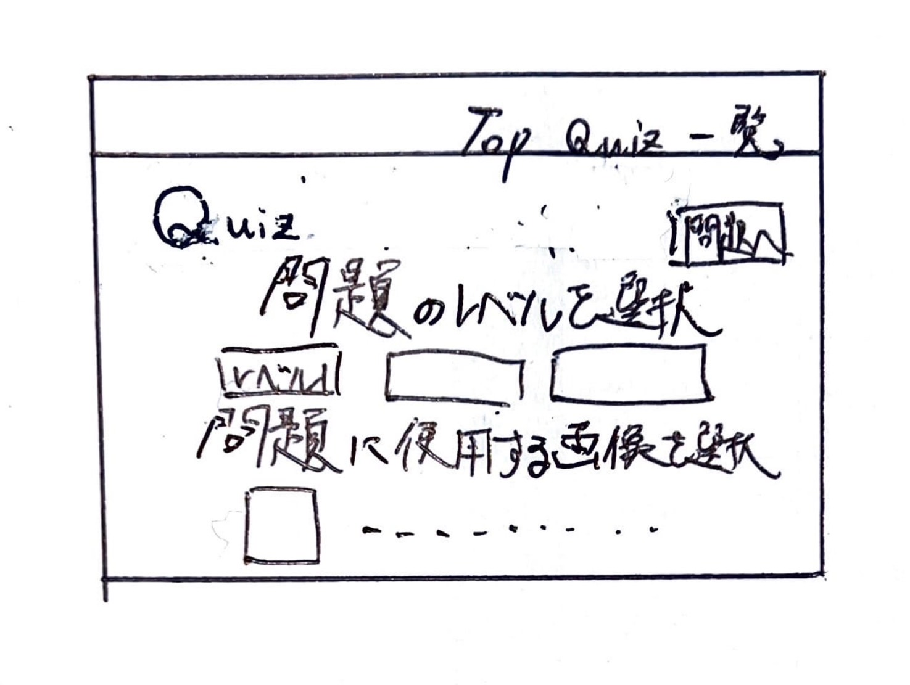
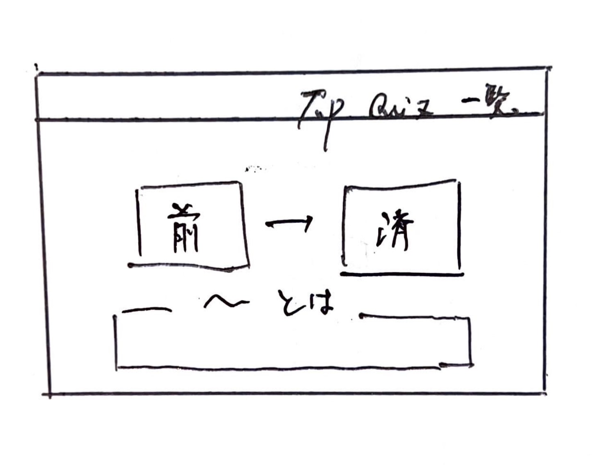

# オブジェクト指向プログラミングおよび演習 第１２回進捗レポート

## 作成者情報

- 学籍番号：00000
- 氏名：00000
- グループ：5
  - メンバー
    - K22059 榊原竜一（チームリーダー）
    - K22041 都築愛弥
    - K22078 高野晴光
    - K22231 伊澤捷
    - K22016 今井翔大
    - K22140 山口瑛士
    - K22072 杉山颯汰
    - K22080 田川裕都
## 仕様

- flaskを使った画像処理クイズアプリ
- 画像をアップロードできる
- アップロードした画像の一覧が見れる
- （画像処理した画像の一覧が見れる）検討中
- アップロードした画像の中から好きな画像を選択してその画像でクイズを行う
- 正誤画面で単語の解説が見れる
- CSSで画面を見やすくする
- （アップロードした画像を消去）検討中
- 他の機能も随時追加

## アプリ完成イメージ

- トップページ
 

- 画像一覧ページ
 

- クイズのレベルと画像の選択ができるページ(レベルの選択と画像の選択のページを分けるかも)
 

- クイズの選択肢の解説ページ
 

## 作業分担

- 画像をアップロードできる、ボタンと画像を一致させる判定の作成（担当：K22041 都築愛弥）
- アップロード画像の保存、一覧表示の作成、チェックボックスの作成と選択画像の保存（担当：K22016 今井翔大）
- 解説ページの作成(学習できるように単語の意味をつける)（担当：K22078 高野晴光、K22140 山口瑛士）
- 写真基礎単語問題の作成（担当：K22231 伊澤捷）
- 画像処理関数の作成(色抜き問題)（担当：K22072 杉山颯汰）
- 画像処理関数の作成(色の加工)（担当：K22080 田川裕都）

## 作業報告

- 画像を保管する仕様を愛知花子と話あって決めた
- 保管した画像がWebページに表示されるところまで愛知花子と共同作業して作った
  - プルリクエストへのリンク
  - 上のプルリクエストがマージされた

## グループ内でお世話になった人2〜3名を理由とともに挙げる

- 画像処理のベースプログラム実装を一緒にした(K23998 愛知花子)
- プルリクエストを処理してくれた（K23999 愛知太郎）
- 調べ物を手伝ってくれた(K23995 工業愛)

## 振り返り（感想含む）と次回までの作業予定

- 計画通りに作業は進んでいる
- 画像を取り扱う共通仕様は愛知花子と共同で作成したが，来週からは作業を分担してすすめる
