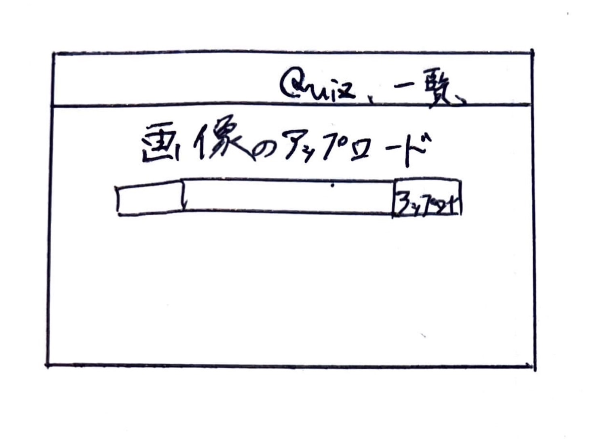
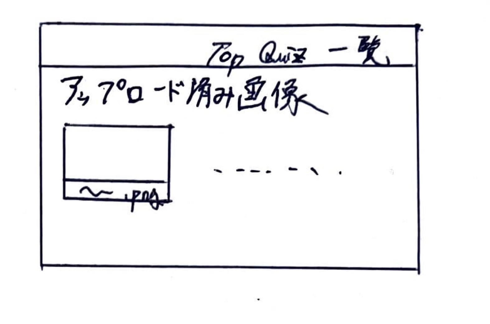
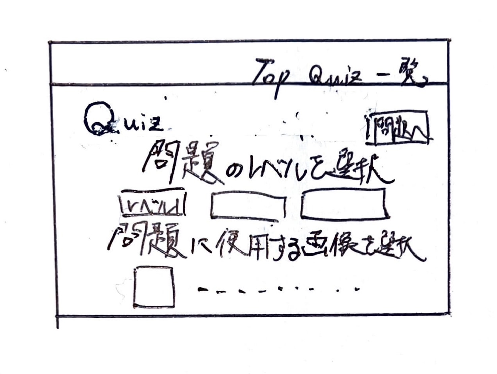

# オブジェクト指向プログラミングおよび演習 第１２回進捗レポート

## 作成者情報

- 学籍番号：K22016
- 氏名：今井翔大
- グループ：5
  - メンバー
    - K22059 榊原竜一（チームリーダー）
    - K22041 都築愛弥
    - K22078 高野晴光
    - K22231 伊澤捷
    - K22016 今井翔大
    - K22140 山口瑛士
    - K22072 杉山颯汰
    - K22080 田川裕都
## 仕様

- flaskを使った画像処理クイズアプリ
- 画像をアップロードできる
- アップロードした画像の一覧が見れる
- （画像処理した画像の一覧が見れる）検討中
- アップロードした画像の中から好きな画像を選択してその画像でクイズを行う
- 正誤画面で単語の解説が見れる
- CSSで画面を見やすくする
- （アップロードした画像を消去）検討中
- 他の機能も随時追加

## アプリ完成イメージ

- トップページ
 

- 画像一覧ページ
 

- クイズのレベルと画像の選択ができるページ(レベルの選択と画像の選択のページを分けるかも)
 

- クイズの選択肢の解説ページ
 

## 作業分担

- 画像をアップロードできる、ボタンと画像を一致させる判定の作成（担当：K22041 都築愛弥）
- アップロード画像の保存、一覧表示の作成、チェックボックスの作成と選択画像の保存（担当：K22016 今井翔大）
- 解説ページの作成(学習できるように単語の意味をつける)（担当：K22078 高野晴光、K22140 山口瑛士）
- 写真基礎単語問題の作成（担当：K22231 伊澤捷）
- 画像処理関数の作成(色抜き問題)（担当：K22072 杉山颯汰）
- 画像処理関数の作成(色の加工)（担当：K22080 田川裕都）

## 作業報告

- 画像をアップロードするページを都築愛弥と協力して作成した
- アップロードした画像一覧ページの作成や、問題に使用する画像と問題のレベルを選択できる機能の実装を榊原竜一の指示のもと作成した
  - https://github.com/2023AIT-OOP2-G05/FinalAssignment/pull/2
  - https://github.com/2023AIT-OOP2-G05/FinalAssignment/pull/4
  - 上のプルリクエストがマージされた

## グループ内でお世話になった人2〜3名を理由とともに挙げる

- 制作物を決める際に積極的に案を出してくれた（K22072 杉山颯汰）
- 画像のアップロード機能の実装に協力してくれた（K22041 都築愛弥）
- プルリクエストを処理してくれた、リーダーとして指示をこまめに出してくれた（K22059 榊原竜一）

## 振り返り（感想含む）と次回までの作業予定

- 制作物の決定に時間がかかったが、計画通りに作業は進んでいる
- 選択されたデータの保存箇所や細かな設計を決めきれていなかったので、ウォーターフォール開発のようになってしまった
- 問題に使用する画像と問題のレベルを選択する機能が完成していないので次回までに都築愛弥に協力してもらいながら開発を進めていきたい
