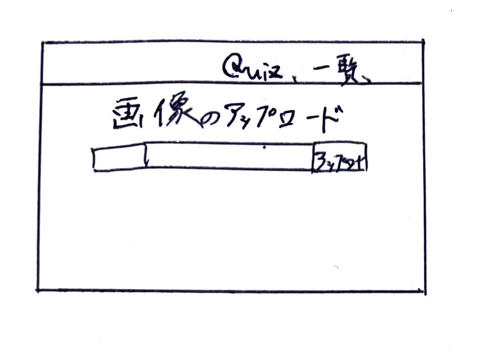

# オブジェクト指向プログラミングおよび演習 第１4回進捗レポート

## 作成者情報

- 学籍番号：
- 氏名：
- グループ：5
  - メンバー
    - K22059 榊原竜一（チームリーダー）
    - K22041 都築愛弥
    - K22078 高野晴光
    - K22231 伊澤捷
    - K22016 今井翔大
    - K22140 山口瑛士
    - K22072 杉山颯汰
    - K22080 田川裕都
## 仕様

- flaskを使った画像処理クイズアプリ
- 画像をアップロードできる
- アップロードした画像の一覧が見れる
- アップロードした画像の中から好きな画像を選択してその画像でクイズを行う
- 正誤画面で単語の解説が見れる
- CSSで画面を見やすくする
- アップロードした画像を消去
- 他の機能も随時追加

## アプリ完成イメージ

- トップページ
 

- 画像一覧ページ
 

- クイズのレベルと画像の選択ができるページ(レベルの選択と画像の選択のページを分けるかも)
 

- クイズの選択肢の解説ページ
 

## 作業分担

- pull requestの認証　全体のサポート（担当：K22059 榊原 竜一）
- 画像をアップロードできる、ボタンと画像を一致させる判定の作成、アップロード画像消去部分の作成（担当：K22041 都築愛弥）
- アップロード画像の保存、チェックボックスの作成と選択画像の保存、アップロード画像消去部分の装飾（担当：K22016 今井翔大）
- 解説ページの作成(学習できるように単語の意味をつける)（担当：K22078 高野晴光、K22140 山口瑛士）
- 写真基礎単語問題の作成（担当：K22231 伊澤捷）
- 画像処理関数の作成(色抜き問題)（担当：K22072 杉山颯汰）
- 画像処理関数の作成(色の加工)（担当：K22080 田川裕都）

## 作業報告

- ユーザーが選択したデータと、正誤結果を'selectData.json'に書き込む処理の実装を行った
- 問題解答後の解説ページの解説文の表示を、押下されたボタンに応じて変更する処理の実装を行った
- 問題の選択肢を追加した
- 一部、正常に動作していないメソッドを修正した
- 解説ページの解説文を正しいものに修正した
- メソッドに渡すパラメータの値を調整した
- 全ての機能が正常に動作しているかテストを行った
  - https://github.com/2023AIT-OOP2-G05/FinalAssignment/pull/24
  - 上のプルリクエストがマージされた

  - https://github.com/2023AIT-OOP2-G05/FinalAssignment/pull/28
  - 上のプルリクエストでの変更は、(https://github.com/2023AIT-OOP2-G05/FinalAssignment/pull/29)に統合してマージされた（K22059 榊原竜一 と協力して行った）

  - https://github.com/2023AIT-OOP2-G05/FinalAssignment/pull/29
  - https://github.com/2023AIT-OOP2-G05/FinalAssignment/pull/35
  - https://github.com/2023AIT-OOP2-G05/FinalAssignment/pull/36
  - 上のプルリクエストをマージした

## グループ内でお世話になった人2〜3名を理由とともに挙げる

- 問題の正誤判定と、ページ遷移する際のデータの流れについて一緒に整理した。（K22041 都築愛弥）
- 全ての機能が動作しているかのテストを協力して行ってくれた。（K22059 榊原竜一）

## 振り返り（感想含む）

- 前回と比べて、各自の作業内容が明確になったので作業を進めやすくなったと感じた。
- 正常な動作をするかテストしている際に、意図せぬ動作をしたときの原因の追求と修正が難しく、時間がかかってしまった。
- 保存したいデータが途中で増えてしまったので、そのアルゴリズムを決めることが難しかった。
