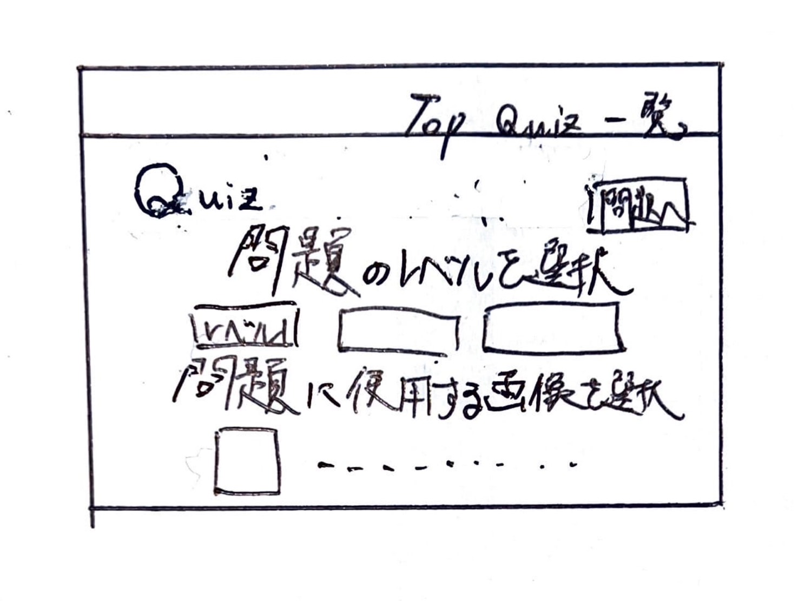

# オブジェクト指向プログラミングおよび演習 第１２回進捗レポート

## 作成者情報

- 学籍番号：
- 氏名：
- グループ：5
  - メンバー
    - K22059 榊原竜一（チームリーダー）
    - K22041 都築愛弥
    - K22078 高野晴光
    - K22231 伊澤捷
    - K22016 今井翔大
    - K22140 山口瑛士
    - K22072 杉山颯汰
    - K22080 田川裕都
## 仕様

- flaskを使った画像処理クイズアプリ
- 画像をアップロードできる
- アップロードした画像を消去できる
- アップロードした画像の中から好きな画像を選択してその画像でクイズを行う
- 画像処理関連の単語クイズを行う
- 正誤画面で単語、画像等の解説が見れる
- CSSで画面を見やすくする
- 他の機能も随時追加

## アプリ完成イメージ
- スタートページ
 

- トップページ
 

- 画像と問題の選択ページ
 

- 問題の解答(色抜き、色彩と明暗問題)ページ
 

- 単語問題ページ
 

- クイズの選択肢の解説ページ
 

## 作業分担

- pull requestの認証　全体のサポート（担当：K22059 榊原 竜一）
- アップロード部分の作成、保存、アップロード画像消去部分の作成、ボタンと画像を一致させる判定の作成、問題ランダム選択機能作成、解説ページの画像を保存させる仕組み（担当：K22041 都築愛弥）
- チェックボックスの作成と選択画像の保存、各ページのレイアウト作成、問題ページの作成、アップロードページとTopページの変更、アップロード画像の消去機能のレイアウト作成、（担当：K22016 今井翔大）
- 解説ページの作成(学習できるように単語の意味をつける)、全体のcssの作成（担当：K22140 山口瑛士）
- 解説ページの作成(学習できるように単語の意味をつける)、発表資料の作成（担当：K22078 高野晴光）
- 写真基礎単語問題の作成、・単語問題と全体のcssの作成（担当：K22231 伊澤捷）
- 画像処理関数の作成(色抜き問題)、全体のcssの作成（担当：K22072 杉山颯汰）
- 画像処理関数の作成(色彩と明暗問題)、ロゴの作成（担当：K22080 田川裕都）

## 作業報告

## グループ内でお世話になった人2〜3名を理由とともに挙げる

## 振り返り（感想含む）と次回までの作業予定

